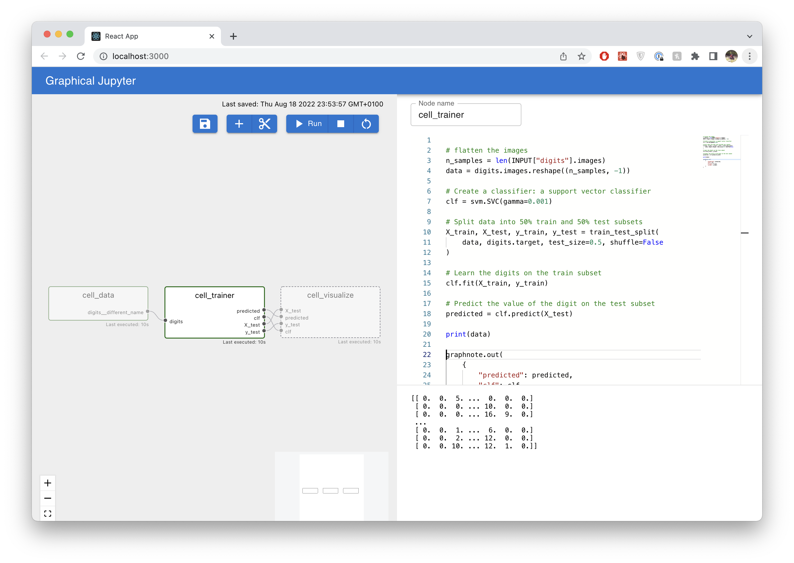

## Interactive Python DAGs

*WIP repo for building a graph jupyter notebook library.*

High-level description:

#### Why:
- Airflow's DAG structure is useful and robust, but unpractical for development &#8594; mainly used for production grade code.
- Jupyter is great for prototyping but gets messy and error-prone (e.g. need to make sure to run things in the right order).

#### What:
* Combine ideas from airflow & jupyter to make an interactive DAG (alternatively = graphical jupyter).
* DAG nodes can be edited and executed (like a notebook). Inputs/outputs are inferred from code.
* Main challenge is the UX. Needs to be as useable as Jupyter, with the benefits of a DAG structure.

#### Example DAG:

